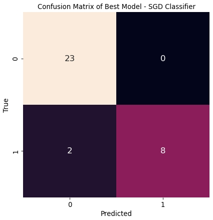
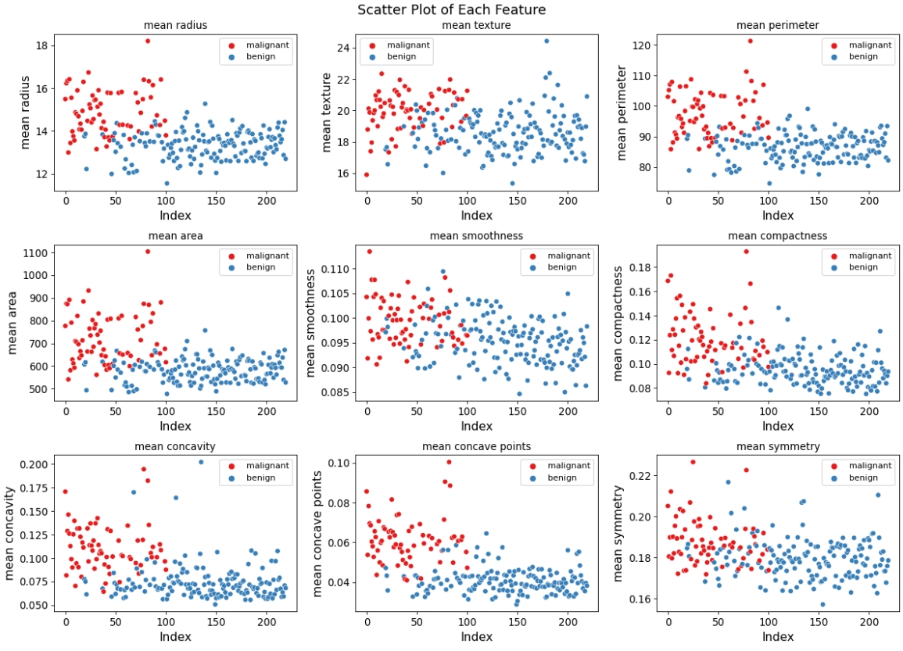
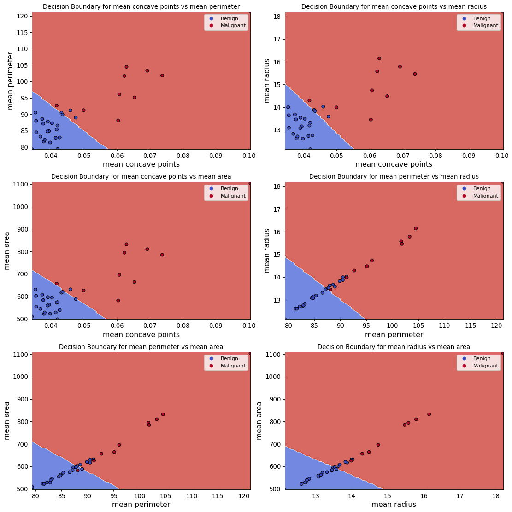

# Client-Driven Classification Analysis

## Overview

This project demonstrates an end-to-end machine-learning classification workflow designed around clearly defined client performance requirements.

Rather than selecting a model based only on overall accuracy, the analysis focuses on choosing evaluation metrics and model parameters according to the practical consequences of different classification errors.

The workflow includes data-quality validation, exploratory analysis, preprocessing, baseline modelling, hyperparameter optimisation, model comparison and final evaluation on an independent test set.

---

## Project Objective

The classification problem involves distinguishing malignant and benign samples using a set of numerical features.

The client defined two key performance requirements:

- Detect at least **90% of malignant cases**.
- Keep the false-positive rate for benign cases below **20%**.

These requirements make model selection a practical decision problem rather than simply an exercise in maximising accuracy.

---

## Analytical Workflow

The project follows the workflow below:

1. Inspect and validate the dataset
2. Identify and correct erroneous values
3. Explore feature distributions
4. Split data into training, validation and test sets
5. Build baseline models
6. Apply preprocessing pipelines
7. Train and compare multiple classification models
8. Select an evaluation metric based on client requirements
9. Perform hyperparameter optimisation
10. Evaluate the selected model on an independent test set
11. Analyse discriminative features and decision boundaries

---

## Data Quality and Preprocessing

Initial data inspection identified several quality issues, including inconsistent class labels, incorrect data types and physically invalid values.

The cleaning and preprocessing workflow included:

- correcting inconsistent labels;
- converting numeric variables stored as non-numeric values;
- identifying invalid negative measurements;
- handling missing values;
- standardising numerical features;
- using pipelines to reduce the risk of data leakage;
- applying stratified train, validation and test splits.

This stage was important because model performance depends on the reliability and consistency of the underlying data.

---

## Model Development

The analysis compared several classification approaches:

- **SGD Classifier**
- **Support Vector Machine (SVM)**
- **Random Forest Classifier**

A random-prediction baseline was also used to provide a reference point for model performance.

Multiple evaluation metrics were considered, including:

- Accuracy
- Balanced Accuracy
- Recall
- Precision
- AUC
- F1-score
- F-beta scores

Because failing to identify a malignant case had the greatest impact on the client requirement, **Recall was selected as the primary optimisation metric**.

Hyperparameter optimisation was then applied to the candidate models before comparing their performance on unseen data.

---

## Final Model

The optimised **SGD Classifier** was selected as the final model.

On the independent test set, the model achieved:

- **Recall: 0.90**
- **Precision: 0.90**
- **Accuracy: 0.94**
- **AUC: 0.93**
- **F1-score: 0.90**

The final model met the specified requirement for malignant-case detection while keeping false positives within the client's acceptable range.

### Final Confusion Matrix

<p align="center">
  
</p>

The confusion matrix provides a direct view of the trade-off between false negatives and false positives, which was more important to this problem than accuracy alone.

---

## Feature Discrimination

To better understand which variables most clearly separated the two classes, individual feature discrimination was assessed using T-scores.

The strongest individual features included:

- mean concave points
- mean perimeter
- mean radius
- mean area

### Most Discriminative Features

<p align="center">
  
</p>

This analysis was used to support further interpretation of the classification behaviour.

---

## Decision Boundaries

Decision boundaries were visualised using combinations of the most discriminative features.

<p align="center">
  
</p>

These visualisations help illustrate how the selected model separates the two classes across different feature combinations.

---

## Key Findings

- Data-quality problems should be resolved before model optimisation.
- Overall accuracy alone is not sufficient when different types of errors have different consequences.
- Model evaluation should reflect the actual requirements of the problem.
- Recall was the most relevant optimisation metric for the defined client objective.
- The optimised SGD classifier provided the best balance between malignant-case detection and false-positive control among the tested models.
- Feature-level analysis can provide additional interpretation beyond aggregate model metrics.

---

## Technologies

- Python
- Pandas
- NumPy
- Matplotlib
- Seaborn
- scikit-learn

---

## Repository Structure

```text
client-driven-classification-analysis/
│
├── README.md
├── requirements.txt
│
├── notebooks/
│   └── 01_client_driven_classification.ipynb
│
└── images/
    ├── final_confusion_matrix.png
    ├── feature_discrimination.png
    └── decision_boundaries.png
